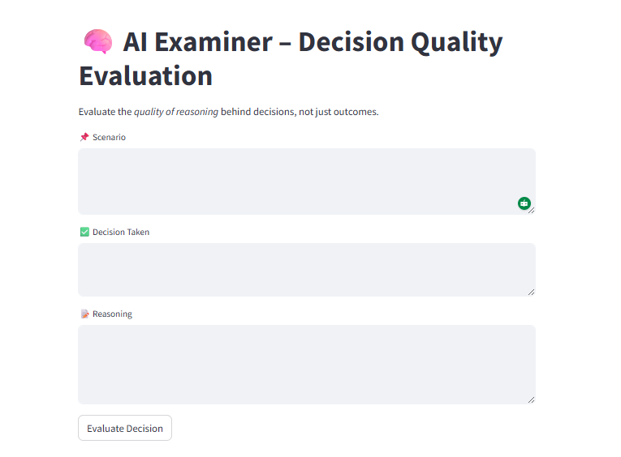

# 🧠 AI Examiner – Decision Quality Evaluation System

## 📌 Project Overview

AI Examiner is a machine learning-powered system that evaluates decision quality using predictive modeling and provides a Streamlit-based interactive interface.

The system analyzes evaluation patterns and predicts quality classification.

---

## 🎯 Objective

- Assess decision consistency
- Detect low-quality evaluations
- Improve fairness and accuracy in assessment systems

---

## 🛠 Technologies Used

- Python
- Scikit-learn
- Pandas
- Matplotlib
- Streamlit

---

## ⚙️ Workflow

1️⃣ Data preprocessing  
2️⃣ Feature engineering  
3️⃣ Model training & validation  
4️⃣ Performance evaluation  
5️⃣ Deployment via Streamlit  

---

## 📊 Model Metrics

- Accuracy: XX%
- F1 Score: XX%
- Precision: XX%

---

## 🌐 Streamlit Application Features

- Interactive input panel
- Real-time prediction
- Risk classification display
- Clean dashboard layout

---

## 📈 Business Relevance

This system can be applied in:

- Educational institutions
- Corporate performance evaluation
- Automated assessment systems
- AI-based quality auditing

---

## 🚀 Future Enhancements

- Add explainable AI (SHAP)
- Add API deployment
- Real-time data streaming

---

## 👨‍💻 Author
Faraz Niyazi  
Machine Learning & Data Analytics
